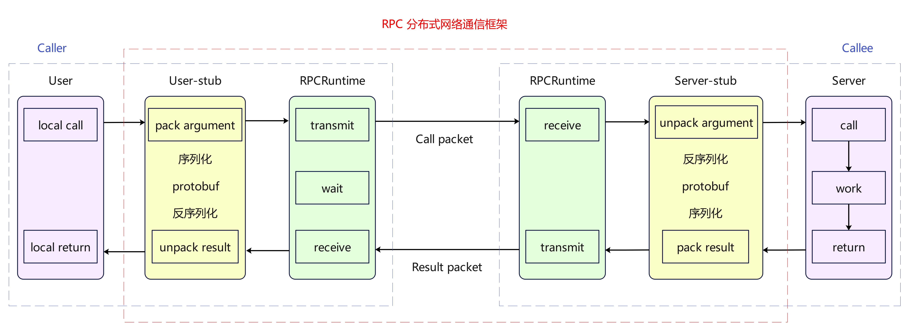
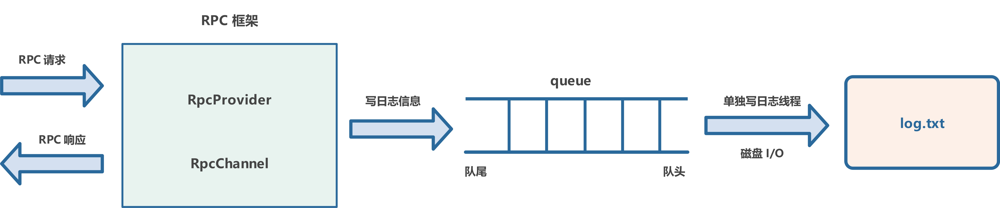
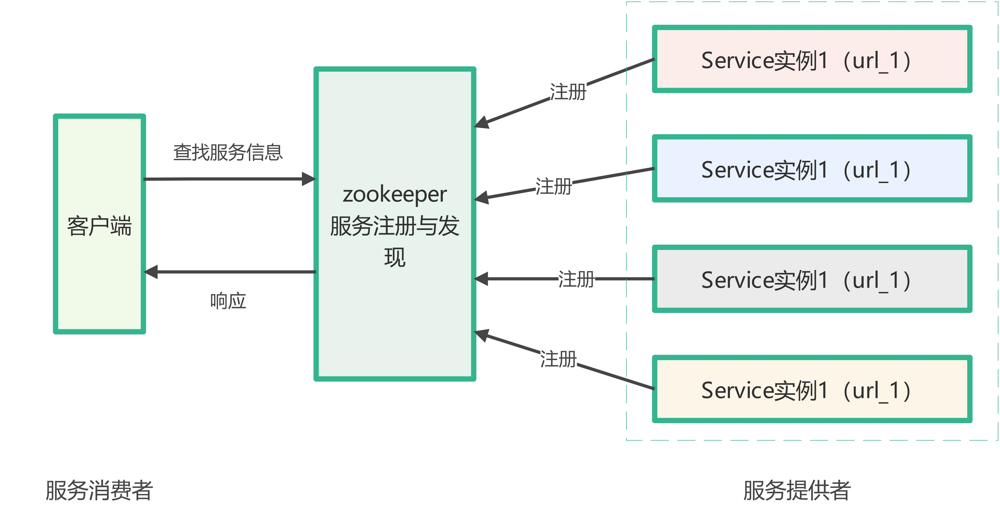

# RPC 分布式网络通信框架

## 代码工程目录

bin：可执行文件

build：项目编译文件

lib：项目库文件

src：源文件

test：测试代码

example：框架代码使用范例

CMakeLists.txt：顶层的 cmake 文件

README.md：项目自述文件

autobuild.sh：一键编译脚本

## 项目介绍

本项目在 Linux 环境下基于 Muduo、Protobuf 和 Zookeeper 实现，重构单体架构的本地方法调用为基于 TCP 的远程调用，支持跨进程和跨机器的服务通信，提供高并发、高效、可靠的 RPC 解决方案。

### RPC 工作流程

1. **客户端代理（Stub）**：客户端调用本地的代理函数，这个代理函数负责将调用的信息（方法名、参数等）序列化并通过网络发送给服务器。
2. **网络传输**：序列化后的数据通过网络传输到服务器。
3. **服务器端代理（Skeleton）**：服务器接收到数据后，代理函数负责将数据反序列化，并调用实际的服务实现函数。
4. **执行并返回结果**：服务器端的服务实现函数执行后，将结果通过代理函数序列化并发送回客户端。
5. **客户端接收结果**：客户端接收到结果后，代理函数将其反序列化并返回给调用者。

### 日志系统设计

### zookeeper 服务配置中心设计

